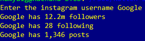

## Instagram Scraper ##

This is an instagram scraper written in Python.
It takes the username of a person as input and returns the number of posts, followers and following.
The BeautifulSoup library built on Python, for the purpose of web-scraping is used here.

